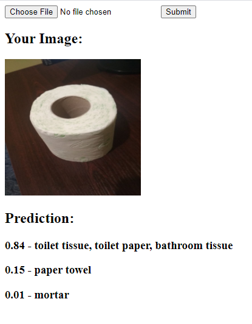

<h1>Simple Flask application for image classification with PyTorch using Docker</h1>

App available in [docker container](https://hub.docker.com/r/yisaienkov/imagenet-classification-web-app)

<h3>Application example</h3>

